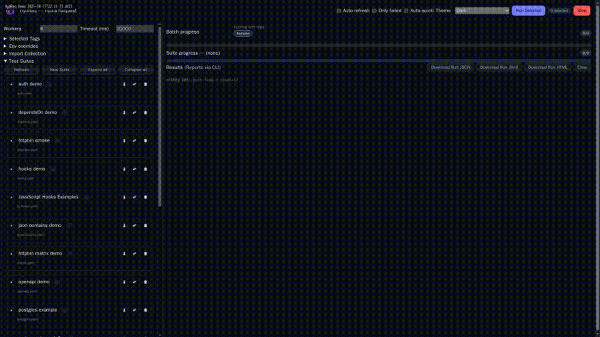

# 🐙 HydReq (Hydra Request)

> 🚀 **API Testing Simplified**  
> Write YAML tests, run in CLI/Web UI, generate reports. Supports matrices, hooks (HTTP/SQL/JS), OpenAPI/Swagger, 7+ import formats, and CI automation.

<table width="100%" border="0" cellpadding="6" cellspacing="0">
  <tr>
    <td width="20%" valign="middle" align="left">
      <a href="https://github.com/DrWeltschmerz/HydReq/actions/workflows/ci.yml"></a></br>
      <a href="https://github.com/DrWeltschmerz/HydReq/releases"></a>
    </td>
    <td width="60%" valign="middle" align="center">
      <a href="go.mod"></a>
      <a href="https://pkg.go.dev/github.com/DrWeltschmerz/HydReq"></a>
      <a href="https://goreportcard.com/report/github.com/DrWeltschmerz/HydReq"></a>
    </td>
    <td width="20%" valign="middle" align="right">
    <a href="https://deepwiki.com/DrWeltschmerz/HydReq" alt="Ask DeepWiki"></a>
    <a href="LICENSE"></a>
    <a href="https://github.com/DrWeltschmerz/HydReq/stargazers"></a>
    </td>
  </tr>
  <tr>
    <td valign="top" align="left" width="20%">
      
    </td>
    <td valign="top" align="center" width="60%">
      <p><strong>Lightweight API test runner with a clean Web UI and CLI.</strong></p>
      <p>Author tests in YAML, run them locally or in CI across Windows, macOS, and Linux. Now with a validator CLI, run-level reports, batch summaries, and a live two‑way Web UI editor.</p>
      <p><em>Note: The `qa` CLI entrypoint has been deprecated; use `hydreq`.</em></p>
    </td>
    <td valign="top" align="right" width="20%">
      <p style="text-align:right; margin:0;">
  <a href="docs/USER_GUIDE.md">📖 User Guide (UI & CLI)</a><br>
  <a href="docs/README.md">� Full Docs Index</a><br>
        <a href="docs/getting-started.md">🚀 Quick Start</a><br>
        <a href="docs/examples.md">🧪 Examples</a><br>
        <a href="#copilot-and-editor-support">🤖 Copilot Setup</a></br>
        <a href="docs/roadmap.md">🧭 Roadmap</a></br>
        <a href="docs/contributing.md">🛠️ Contributing</a>
      </p>
    </td>
  </tr>
</table>



## Documentation

- Full docs: `docs/README.md`
- Quick links: [Getting started](docs/getting-started.md), [Docker](docs/docker.md), [Web UI](docs/web-ui.md), [CLI](docs/cli.md), [Authoring](docs/authoring.md), [Scheduling](docs/scheduling.md), [Hooks](docs/hooks.md), [SQL hooks](docs/sql-hooks.md), [JavaScript scripting](docs/scripting.md), [OpenAPI](docs/openapi.md), [Visual editor](docs/visual-editor.md), [Adapters](docs/adapters.md), [Reports](docs/reports.md), [Examples](docs/examples.md), [Troubleshooting](docs/troubleshooting.md), [Contributing](docs/contributing.md), [Roadmap](docs/roadmap.md), [What's new](CHANGELOG.md), Cheatsheets: [Suite](docs/cheatsheets/suite.cheatsheet.md), [Assertions](docs/cheatsheets/assertions.cheatsheet.md)

## Contents

- [For end users](#for-end-users)
  - [Quick start (GUI)](#quick-start-gui)
  - [Quick start (CLI)](#quick-start-cli)
  - [Install](#install)
  - [Using the Web UI](#using-the-web-ui)
  - [Using the CLI](#using-the-cli)
  - [Copilot and editor support](#copilot-and-editor-support)
  - [Data generators](#data-generators)
  - [Features](#features)
  - [Docker usage](#docker-usage)
  - [Adapters (import)](#adapters-import)
  - [Reports](#reports)
  - [Screenshots & E2E demo](#screenshots--e2e-demo)
  - [User Guide](#user-guide)
  - [Batch run and summaries](#batch-run-and-summaries)
  - [Example suites (at a glance)](#example-suites-at-a-glance)
- [Contributing & development](#contributing--development)
- [License](#license)

---

## For end users

### Quick start (GUI)

1) Download a prebuilt archive from the Releases page for your OS/arch.
2) Unzip and run the `hydreq` binary.
3) Your browser opens at http://127.0.0.1:8787.
  - Left: select suites from `testdata`, set Workers, Tags (optional), Default timeout (optional), and env overrides (KEY=VALUE).
   - Right: progress for batch/suite/stages and a console with per-test start/result lines and collapsible details.

### Quick start (CLI)

1) Download a prebuilt release archive for your OS/arch and unzip.
2) Run a suite from the terminal:

```
./hydreq run -f testdata/example.yaml --workers 4 -v
```

3) Optional reports (JSON + JUnit):

```
./hydreq run -f testdata/example.yaml \
  --report-json report.json \
  --report-junit report.xml
```

### Install

- **Prebuilt binaries (recommended):** Download from [Releases](https://github.com/DrWeltschmerz/HydReq/releases). Archives include examples (`testdata/`), JSON schema, VS Code mappings, and Copilot prompts.
- **Docker:**
  ```bash
  # Run the Web UI
  docker run -p 8787:8787 ghcr.io/drweltschmerz/hydreq:latest
  
  # Run tests from a local directory
  docker run -v $(pwd)/testdata:/testdata ghcr.io/drweltschmerz/hydreq:latest run -f /testdata/example.yaml -v
  
  # Run all tests in a directory
  docker run -v $(pwd)/testdata:/testdata -v $(pwd)/reports:/reports \
    ghcr.io/drweltschmerz/hydreq:latest run --report-dir /reports
  ```
- **From source:**
  - `go install github.com/DrWeltschmerz/HydReq/cmd/hydreq@latest`
  - or `go build -o bin/hydreq ./cmd/hydreq`

### Using the Web UI

- Start: run `hydreq` with no arguments (opens the local GUI).
- Controls: Only failed, Auto-scroll, Theme selector (light/dark and more), Stop. Keyboard shortcuts: r=run, s=stop, c=clear, f=only failed, d=dark.
- Each test shows a blue “starting” line, then flips to ✓/✗/– when done. Failures include expandable details.
- A summary appears for every suite and a final batch summary aggregates pass/fail/skip.
- Editor: Click “Edit” next to a suite for a Visual + YAML editor with validation, Quick Run (with deps), hook editing (HTTP/SQL), and Save vs Save & Close.
  - Tip: For CI artifacts (JSON/JUnit/HTML), prefer the CLI flags `--report-json` / `--report-junit` / `--report-html`.
  - Extras: Live two‑way sync between YAML and Visual; malformed YAML keeps YAML editable and temporarily disables Visual; tabs are converted to spaces automatically; dark theme by default; density toggle; resizable preview; SQL DSN helper templates and show/hide for DSNs.

Refactor notes
- The Web UI is currently being refactored to smaller modules with a store‑first state and stable public helpers.
- See: [docs/web-ui.md](docs/web-ui.md) for architecture notes and [docs/ui-refactor-plan.md](docs/ui-refactor-plan.md) for the phased plan.

### Using the CLI

- Run all suites: `./hydreq run --workers 4 -v` (when `-f` is omitted, HydReq discovers and runs all suites under `testdata/`).
- Run a single suite: `./hydreq run -f testdata/example.yaml --workers 4 -v`
- Reports: add `--report-json report.json`, `--report-junit report.xml`, and/or `--report-html report.html` for detailed outputs.

Auto-generate reports (no per-report flags)
- Generate JSON, JUnit, and HTML with default names for all suites:
  - `./hydreq run --report-dir reports`
- Or for one suite:
  - `./hydreq run -f testdata/example.yaml --report-dir reports`
Naming:
- Per-suite: `<suite>-<timestamp>.{json,xml,html}`
- Run-level (batch): `run-<timestamp>.{json,xml,html}`

Validate suites locally (optional but recommended)

```
go build -o bin/validate ./cmd/validate
./bin/validate -dir testdata -schema schemas/suite.schema.json
```

The CI runs this validator too and will fail if any suite drifts from the schema.

Exit codes
- `0` all tests passed; `1` test failures; `2` suite failed to load or is not runnable (invalid YAML, missing baseUrl for path URLs). Not‑runnable suites do not emit results and appear in the batch report's Not Run section.

CLI flags
- `--file` (or `-f`): path to YAML suite (optional; when omitted, all suites in `testdata/` are run)
- `--workers`: concurrent workers per stage (default 4)
- `--tags`: comma-separated tag filter (any-of)
- `--default-timeout-ms`: default per-request timeout when `test.timeoutMs` is not set (default 30000)
- `--verbose` (or `-v`): verbose failure details
- `--report-json` / `--report-junit`: write detailed reports to files

Exit codes
- `0`: all tests passed
- `1`: tests failed
- `2`: suite load error

### Copilot and editor support

HydReq ships with a JSON Schema and Copilot prompts so you get completions, validation, and smarter AI assistance while writing suites.

What you get
- Schema-backed completions and hover docs for fields (name, request, assert, matrix, hooks, etc.).
- Instant validation with problem squiggles when keys/values don’t match the schema.
- Copilot hints tailored to HydReq’s YAML via curated prompts and examples.

How to use it (quick)
1) Open this repository in VS Code (or copy `schemas/` and `.copilot/` into your project).
2) Ensure the YAML extension is installed (ms-azuretools.vscode-yaml).
3) The repo’s `.vscode/settings.json` already maps the schema; open any `*.yaml` in `testdata/` and you’ll get completions.
4) For your own project, add this mapping in VS Code settings:

```json
"yaml.schemas": {
  "./schemas/suite.schema.json": [
    "suite.yaml",
    "suites/**/*.yaml",
    "**/hydreq*.yaml"
  ]
}
```

Copilot tips that work
- Open `.copilot/prompts/suite.prompts.md` side-by-side with your suite YAML. Copilot reads open tabs and adapts suggestions.
- Start with a short comment describing your target API, baseUrl, and auth. Example:

```yaml
# HydReq: httpbin smoke; baseUrl=${ENV:HTTPBIN_BASE_URL}; tags=smoke
```

- Use one well-formed example test; then ask Copilot for variations (matrix, tags, retries) and it’ll stay on-rails.
- Keep schema visible: hover a field to see allowed keys/values; fix squiggles early.

Where things live
- Schema: `schemas/suite.schema.json`
- Prompts: `.copilot/prompts/suite.prompts.md`
- VS Code how-to: `.copilot/README.md` (includes a ready-to-copy `yaml.schemas` snippet)

VS Code helpers
- Task: “hydreq: Run current suite” (Terminal → Run Task) runs the active YAML with the built `hydreq`.
- Scripts: `scripts/pr-summary.sh` (PR markdown from a JSON report), `scripts/suggest-assertions.sh` (checklist of suggested assertions from last report).

### Data Generators

Embed dynamic data anywhere interpolation works:
- `${FAKE:uuid}` — random UUID v4
- `${EMAIL}` — random email like `qa-<hex>@example.com`
- `${NOW:<layout>}` — current time formatted with Go layout (e.g., `${NOW:2006-01-02}`)
- `${NOW+/-offset:<layout>}` — time offset by s/m/h/d/w (e.g., `${NOW+1d:2006-01-02}`)
- `${RANDINT:min:max}` — random integer in `[min, max]`

### Features

| Feature | Description |
|---------|-------------|
| 🧪 YAML Suites | Variables, environment overrides, matrices |
| 🌐 HTTP Requests | Methods, headers, query, body with full control |
| ✅ Assertions | Status, headers, JSON paths, body contains, response time |
| 🔄 Extractions | Pull variables from responses (JSONPath) for reuse |
| 🎨 Colorful CLI | Per-stage concurrency, worker pools, progress |
| 🏷️ Tags & Filtering | Run subsets with `--tags` |
| 🔁 Retries | With backoff, jitter, and configurable limits |
| 🔐 Auth Helpers | Bearer/Basic via environment variables |
| 📊 Matrix Expansion | Data-driven test combinations |
| 🪝 Hooks | Pre/post suite/test with HTTP, SQL, and JavaScript execution |
| 📋 Reports | JSON, JUnit, HTML with summaries and details |


### Docker Usage

HydReq provides an official lightweight Docker image for easy deployment and CI/CD integration.

#### Quick Start

**Run the Web UI:**
```bash
docker run -p 8787:8787 ghcr.io/drweltschmerz/hydreq:latest
# Then open http://localhost:8787 in your browser
```

**Run CLI tests:**
```bash
# Run a single suite
docker run -v $(pwd)/testdata:/testdata \
  ghcr.io/drweltschmerz/hydreq:latest \
  run -f /testdata/example.yaml -v

# Run all suites with reports
docker run -v $(pwd)/testdata:/testdata \
           -v $(pwd)/reports:/reports \
  ghcr.io/drweltschmerz/hydreq:latest \
  run --workers 4 --report-dir /reports
```

#### Environment Variables

Pass environment variables to tests:
```bash
docker run -p 8787:8787 \
  -e HTTPBIN_BASE_URL=http://api.example.com \
  -e DEMO_BEARER=your-token \
  ghcr.io/drweltschmerz/hydreq:latest
```

#### Available Tags

- `latest` — Latest stable release from main branch
- `v1.2.3` — Specific version
- `v1.2` — Latest patch version
- `v1` — Latest minor version
- `main` — Latest commit from main branch (development)

#### Image Details

- **Base:** Alpine Linux (minimal footprint)
- **Size:** ~30MB compressed
- **Architectures:** `linux/amd64`, `linux/arm64`
- **User:** Runs as non-root user `hydreq` (UID 1000)
- **Port:** 8787 (Web UI)

#### CI/CD Integration

Use in GitHub Actions:
```yaml
jobs:
  api-tests:
    runs-on: ubuntu-latest
    steps:
      - uses: actions/checkout@v4
      - name: Run API tests
        run: |
          docker run -v $(pwd)/testdata:/testdata \
                     -v $(pwd)/reports:/reports \
            ghcr.io/drweltschmerz/hydreq:latest \
            run --report-dir /reports
```


### Adapters (import)

- Postman (v2.1 JSON)
- Insomnia (export JSON)
- HAR (HTTP Archive)
- OpenAPI (3.x) / Swagger (2.0)
- Bruno (minimal export)
- REST Client (VS Code .http)
- Newman (Postman CLI)

### CLI examples:

```
hydreq import postman path/to/collection.json > suite.yaml
hydreq import postman path/to/collection.json --env path/to/environment.json > suite.yaml
hydreq import postman path/to/collection.json --env path/to/environment.json --base-url https://staging.api.com --verbose > suite.yaml
hydreq import insomnia path/to/export.json > suite.yaml
hydreq import har path/to/archive.har > suite.yaml
hydreq import openapi path/to/spec.(yaml|json) > suite.yaml
hydreq import bruno path/to/export.json > suite.yaml
hydreq import restclient path/to/requests.http > suite.yaml
hydreq import newman path/to/collection.json > suite.yaml
hydreq import newman path/to/collection.json --env path/to/environment.json > suite.yaml
```

### Reports

- JSON, JUnit, and HTML detailed reports include per-test entries and suite summaries. HTML reports are theme-aware (same palette as the Web UI) and include donut charts, filters, and sticky headers.
- Using `--report-dir` generates timestamped per-suite artifacts and run-level (batch) artifacts: `run-<timestamp>.{json,xml,html}`.


### User Guide

Prefer a single, robust guide to all features? Start here:

- docs/USER_GUIDE.md — UI + CLI in one place, with links to screenshots and the detailed Visual Editor guide.

Maintenance note: Prefer updating the single User Guide and Visual Editor guide when features change, and prune overlapping sections in other docs over time to reduce duplication.

### Batch run and summaries

- Run multiple suites and generate summaries in one go (works from a release archive):

```
./scripts/run-suites.sh                 # defaults to testdata/*.yaml
# or provide your own globs
./scripts/run-suites.sh suites/*.yaml other/*.yaml
```

### Outputs

- Per-suite: `reports/<suite>.{json,xml}`
- Batch Markdown: `reports/PR_SUMMARY_ALL.md` (aggregated totals + failed tests)
- Latest suite Markdown: `reports/PR_SUMMARY.md` (plus suggested assertions)

Optional PR comment

- CI automatically posts detailed batch run summaries as comments on pull requests (no setup required).
- For manual posting from local runs, set `GH_PR_REF=<pr-number-or-url>` and install GitHub CLI (`gh`).
- See an example automated summary comment: [GitHub PR Comment](https://github.com/DrWeltschmerz/HydReq/pull/6#issuecomment-3325685621)

### Example suites (at a glance)

- `testdata/example.yaml` — smoke and extraction
- `testdata/matrix.yaml` — matrix expansion
- `testdata/depends.yaml` — DAG scheduling
- `testdata/hooks.yaml` — HTTP hooks
- `testdata/js-hooks.yaml` — JavaScript hooks
- `testdata/sqlite.yaml` — SQL hooks
- `testdata/openapi.yaml` — OpenAPI validation
- `testdata/tags.yaml` — tags and slow example
- `testdata/retries.yaml` — retries with jitter
- `testdata/jsoncontains.yaml` — JSONContains
- `testdata/postgres.yaml` / `sqlserver.yaml` — DB examples (env DSNs)

---

## JavaScript Hooks

HydReq supports advanced scripting with JavaScript hooks for complex test logic, dynamic data generation, and response processing.

```yaml
tests:
  - name: Dynamic data generation
    pre:
      - name: Generate test data
        js:
          code: |
            setVar('user_id', Math.floor(Math.random() * 1000));
            setVar('timestamp', new Date().toISOString());
    request:
      method: POST
      url: /users
      body:
        id: ${user_id}
        created: ${timestamp}
```

**Available in JS hooks:**
- `setVar(name, value)` — Set variables for use in templates
- `getVar(name)` — Get variable values
- `request` — Access to the current HTTP request object
- `response` — Access to the HTTP response (in post hooks)
- Full JavaScript runtime with standard libraries

See `docs/hooks.md` and `testdata/js-hooks.yaml` for comprehensive examples.

---

## Contributing & development

See `docs/contributing.md` for setup, local development, project layout, and roadmap.

---

## License

GNU GPLv3 © 2025 DrWeltschmerz and contributors. See the LICENSE file for details.


