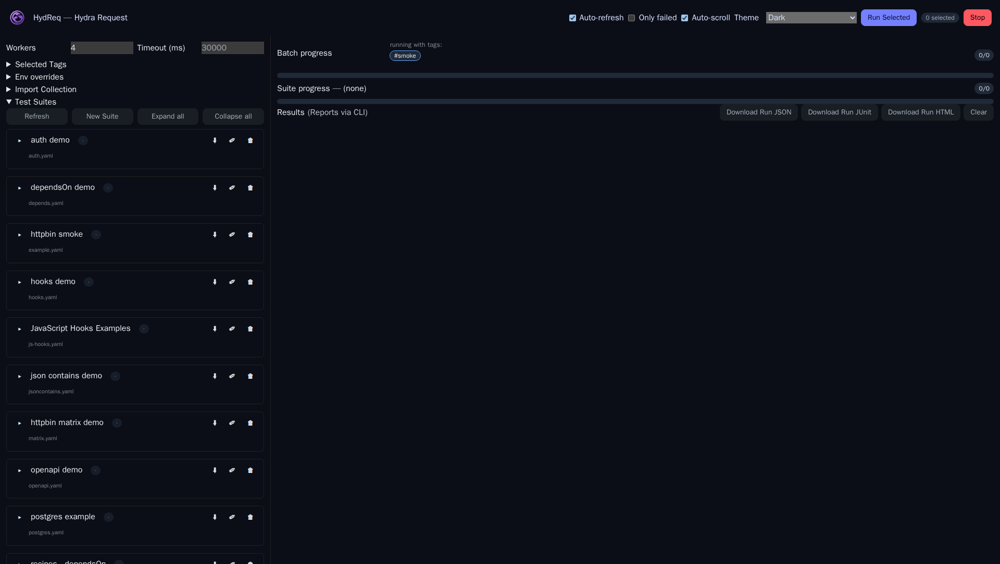
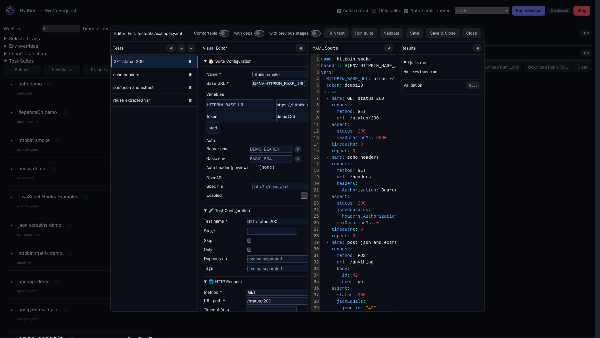
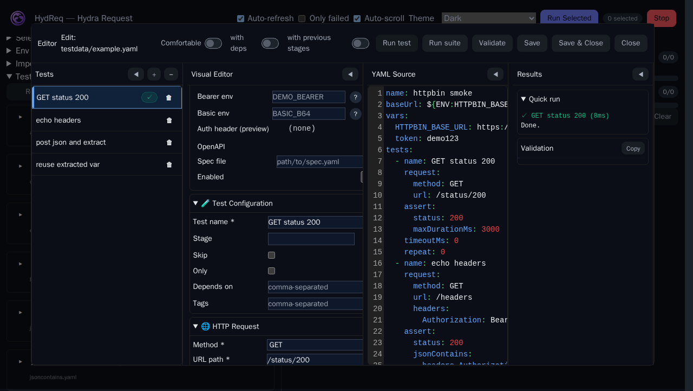
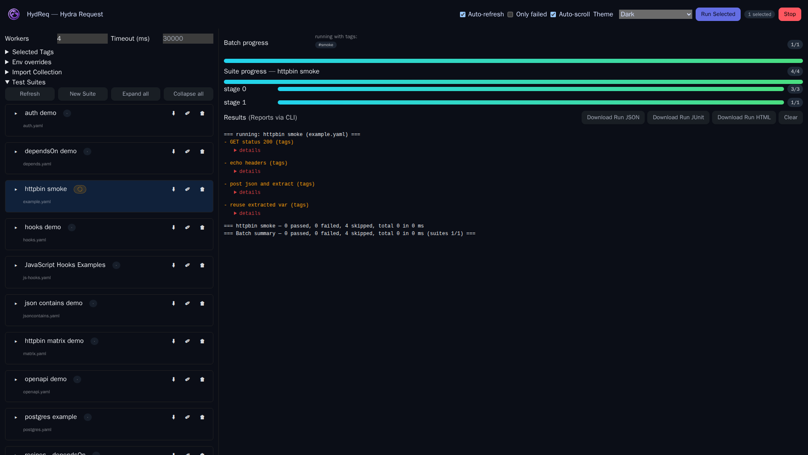

# Visual YAML Editor (beta)

The Web UI includes a visual editor for suite YAMLs. Author tests quickly in forms, validate in real time, and keep your YAML clean on save.

## What you can do

- Browse, add, and delete tests.
- Request editor: method, URL/path, timeout, headers, query, body (JSON or text).
- Assertions: status, header equals, JSON equals/contains, body contains, max response time.
- Extract: capture values via gjson paths (examples: `json.id`, `data.items.0.id`).
- Flow & meta: skip/only, stage, tags, dependsOn, timeout.
- Retry: max/backoff/jitter with optional jitter %.
- Matrix: var → [values] for cartesian expansion.
- OpenAPI: per-test override (inherit/enable/disable); suite-level OpenAPI in the Suite tab.
- Hooks (HTTP/SQL):
  - Add hook rows via templates (Empty/HTTP/SQL). Each row locks its mode and shows only relevant fields.
  - HTTP hooks: method, URL, headers, query, body.
  - SQL hooks: driver (sqlite/pgx/sqlserver), DSN with show/hide, DSN templates, query, extract column→var.
  - Collapse/expand rows; badges show HTTP/SQL; inline “Run” to validate that hook and view messages/extracted vars.

## YAML tab and two-way sync

- Live roundtrip:
  - YAML → Visual: when YAML parses, the Visual tab immediately refreshes and re-enables.
  - Visual → YAML: every control change updates YAML live, including add/remove rows.
- Malformed YAML keeps the YAML tab editable and temporarily disables the Visual tab. Tabs are auto‑converted to spaces.
- Save from YAML preserves your formatting/comments; Save from Visual writes a minimal stable YAML with `omitempty`.

## Quick Run and validation

- Quick Run executes just the selected test (or the whole suite from the YAML tab). You can toggle:
  - “with deps” — include transitive `dependsOn` chain.
  - “with previous stages” — include all earlier stages before the selected test.
- Validation aggregates schema errors with file/line and friendly hints (e.g., when tabs are detected). You can copy the issues list with the YAML preview.

## Batch run from the main view

- Select suites in the list and press Run to execute in stages with real-time progress and logs.
- The console shows a start line and a result line per test. Failures include collapsible details.
- Headers allow filtering only-failed, toggling auto-scroll, and switching themes.

## Tips and shortcuts

- Keyboard: r (run), s (stop), c (clear), f (only failed), d (dark).
- Theme selector and density toggle for comfortable editing.
- Download JSON/JUnit/HTML run artifacts from the UI; for CI, prefer CLI `--report-*` flags or `--report-dir`.
- Active environment overrides and tags are visible as pills in the header and rehydrate on refresh.

## Notes

- Edits are restricted to `testdata/`.
- YAML serialization uses `omitempty` so empty fields are omitted; strings that could be misread (yes/on/numeric-looking) are quoted.
- OpenAPI validation runs when configured at the suite level and enabled for the test.
- More engine-level validations will continue to improve over time.
